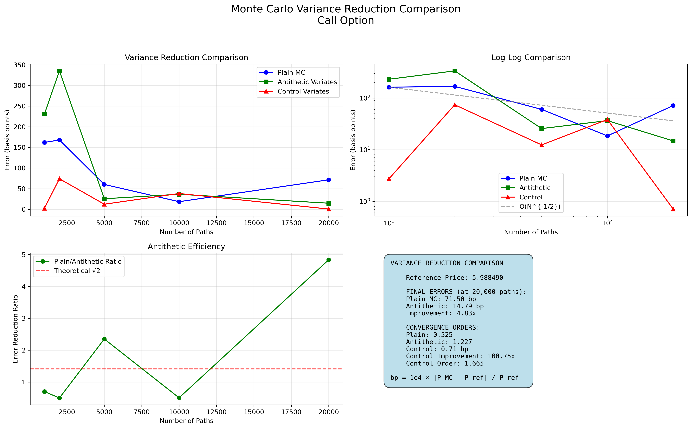
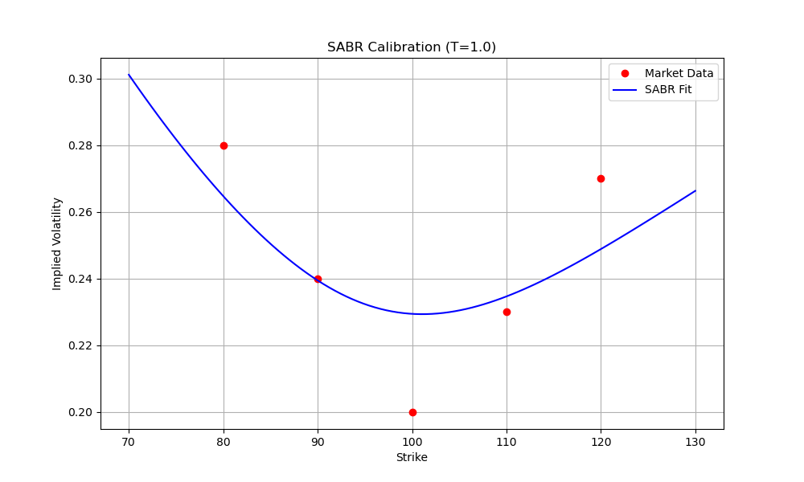
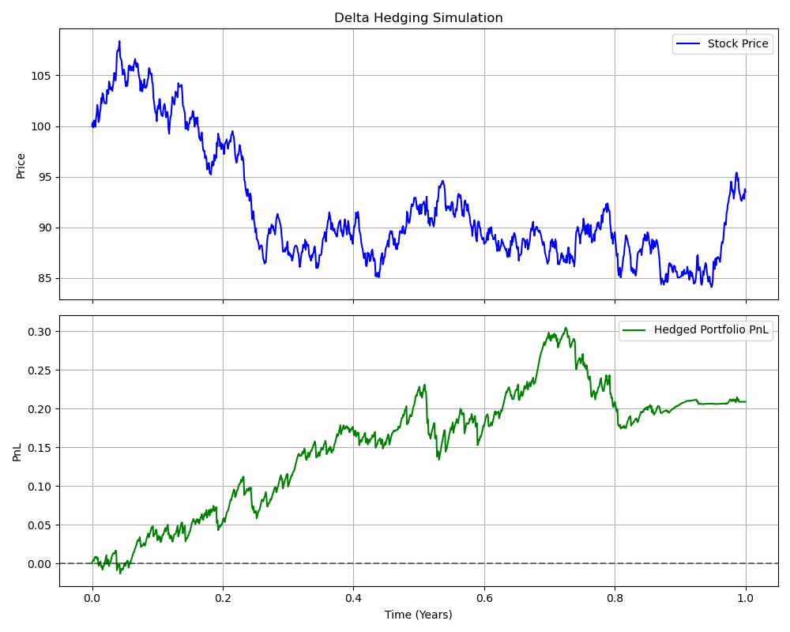

# Quantitative Options Pricing Library

[](https://opensource.org/licenses/MIT)
[](https://www.python.org/downloads/)
[](https://github.com/psf/black)

An algorithmic options pricing system engineered in Python, designed to handle complex derivatives modeling and risk management. This library implements industry-standard numerical methods including Crank-Nicolson Finite Difference schemes, Monte Carlo simulations with variance reduction, and stochastic volatility calibration.

It serves as a comprehensive toolkit for quantitative analysts, offering robust solvers for both European and American option pricing, along with a full suite of Greek calculations for dynamic hedging strategies.

## Key Features & Technical Implementation
*   **Analytical**: Black-Scholes-Merton framework for European options.
### Advanced Pricing Engines
*   **Finite Difference Methods (PDE):**
    *   Implemented **Crank-Nicolson** time-stepping scheme for unconditional stability and second-order accuracy.
    *   Utilized **Projected Successive Over-Relaxation (PSOR)** to handle the early exercise boundary of American options.
    *   Features sparse matrix operations for optimized grid solving performance.
*   **Monte Carlo Simulations:**
    *   Engineered a high-performance simulation engine supporting **Antithetic Variates** and **Control Variates** for significant variance reduction.
    *   Implemented **Longstaff-Schwartz** Least Squares Monte Carlo (LSM) algorithm for pricing American options via regression-based continuation value estimation.
    *   Supports pathwise delta calculation for efficient Greek sensitivity analysis.
*   **Tree Methods:**
    *   Binomial (CRR, Jarrow-Rudd) and Trinomial lattice models for fast approximation of American exercises.

### Stochastic Volatility & Calibration
*   **SABR Model:**
    *   Full implementation of the **Hagan (2002)** asymptotic approximation formula.
    *   Includes a robust calibration engine using `scipy.optimize.minimize` (L-BFGS-B) to fit model parameters ($\alpha, \beta, \rho, \nu$) to market volatility smiles.
*   **Heston Model:**
    *   Semi-analytical pricing using Fourier integration of the characteristic function.
    *   Capable of capturing rich volatility surface dynamics (skew and smile).

### Quantitative Risk Management
*   **Dynamic Greeks:**
    *   Real-time calculation of first and second-order sensitivities: Delta ($\Delta$), Gamma ($\Gamma$), Vega ($\nu$), Theta ($\Theta$), and Rho ($\rho$).
    *   Supports both analytical (Black-Scholes) and numerical differentiation (Finite Difference/Pathwise) for all engine types.
*   **Delta Hedging Simulator:**
    *   A complete backtesting environment to simulate delta-neutral portfolio management.
    *   Tracks PnL attribution, hedge slippage, and "Gamma Bleeding" in discrete time rebalancing scenarios.

### Software Engineering Excellence
*   **Type Safety:** Fully typed codebase using Python `typing` module for rigorous static analysis.
*   **Testing:** Comprehensive `pytest` suite ensuring numerical convergence and regression testing.
*   **CI/CD:** GitHub Actions workflows for automated testing on every commit, ensuring production readiness.

## Visuals

### Monte Carlo Convergence

*Convergence of Monte Carlo simulations showing variance reduction techniques.*


*Calibration of SABR model to market smile.*

### Hedging Simulation

*Delta hedging simulation tracking portfolio value over time.*

## Installation

```bash
git clone https://github.com/yourusername/quantitative-options-pricing.git
cd quantitative-options-pricing
pip install -e .
```

## Usage

### 1. Simple Option Pricing (Black-Scholes)

```python
from quantlib.core.payoffs import OptionContract
from quantlib.pricing.analytical import BlackScholesEngine

# Define Option: Call, Spot=100, Strike=100, T=1yr, r=5%, vol=20%
option = OptionContract(spot=100, strike=100, time_to_expiry=1.0,
                       risk_free_rate=0.05, volatility=0.2)

# Price
engine = BlackScholesEngine()
price = engine.price(option)
greeks = engine.greeks(option)

print(f"Call Price: {price.price:.4f}")
print(f"Delta: {greeks.delta_call:.4f}")
```

### 2. Monte Carlo Simulation with Plotting

```python
from quantlib.pricing.monte_carlo import MonteCarloEngine

# Use Monte Carlo Engine with 100,000 simulations
mc_engine = MonteCarloEngine(n_steps=50, n_paths=100000)
mc_result = mc_engine.price(option)

print(f"MC Price: {mc_result.price:.4f} +/- {mc_result.standard_error:.4f}")
```

### 3. Advanced Volatility Modeling

The library supports implied volatility calculation and calibration of stochastic volatility models.

#### Volatility Surface & Implied Volatility
Build a volatility surface from market option chains and interpolate implied volatilities.

```python
from quantlib.calibration.implied_vol import VolatilitySurface
from quantlib.utils.market_data import OptionChain, MarketQuote, OptionType

# Create surface
surface = VolatilitySurface(spot_price=100.0, risk_free_rate=0.05)

from datetime import datetime

# Build Option Chain
chain = []
for k, price in [(90, 14.5), (100, 8.5), (110, 4.5)]:
    chain.append(MarketQuote(
        symbol="EX", strike=k, bid=price-0.05, ask=price+0.05, 
        time_to_expiry=1.0, option=OptionType.CALL, timestamp=datetime.now()
    ))
surface.add_chain(chain)

# Get Implied Volatility for any Strike/Expiry (Bilinear interpolation)
iv = surface.get_iv(strike=105, expiry=1.0)
print(f"Interpolated IV at Strike 105: {iv:.4f}")
```

#### SABR Calibration
```python
from quantlib.calibration.sabr import SABRCalibrator

# Market data: List of (Strike, Matrix IV)
market_data = [(90, 0.24), (95, 0.22), (100, 0.20), (105, 0.19), (110, 0.195)]
forward = 100.0
expiry = 1.0

# Calibrate
calibrator = SABRCalibrator()
params = calibrator.calibrate(market_data, forward, expiry)

print(f"SABR Alpha: {params.alpha:.4f}")
print(f"SABR Rho: {params.rho:.4f}")
print(f"SABR Nu: {params.nu:.4f}")
```

#### Heston Model Pricing
```python
from quantlib.calibration.heston import HestonParameters, HestonPricingEngine

# Define Heston Parameters
params = HestonParameters(
    v0=0.04,     # Initial variance
    kappa=2.0,   # Mean reversion speed
    theta=0.04,  # Long-run variance
    sigma=0.3,   # Vol of Vol
    rho=-0.7     # Correlation
)

# Price using Semi-Analytical Engine (Fourier Integration)
engine = HestonPricingEngine()
price = engine.price(spot=100, strike=100, time_to_expiry=1.0, 
                    risk_free_rate=0.05, params=params)

print(f"Heston Call Price: {price:.4f}")
```

### 4. Dynamic Delta Hedging Simulation

Simulate and visualize the performance of delta hedging strategies under geometric Brownian motion.

```python
from quantlib.hedging.delta_hedging import DeltaHedging

# Setup simulation: Spot=100, Strike=100, 3 months, 20% vol
hedger = DeltaHedging(S0=100, K=100, T=0.25, r=0.05, sigma=0.20)

# Run Monte Carlo simulation of hedging path
results = hedger.simulate_hedging(n_steps=50, n_simulations=1000, hedge_frequency=1)
analysis = hedger.analyze_results(results)

print(f"Mean Hedging Error: {analysis['mean_hedging_error']:.4f}")
# Visualize with: hedger.plot_simulation(results)
```

## Testing

Run the comprehensive test suite using `pytest`:

```bash
pytest quantlib/tests
```

## License

This project is licensed under the MIT License - see the [LICENSE](LICENSE) file for details.

## Author

**Alexios Philalithis**
